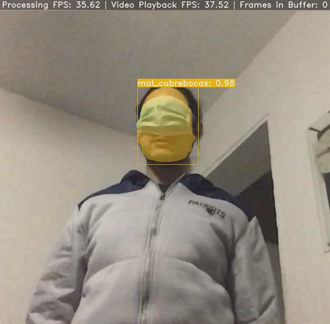
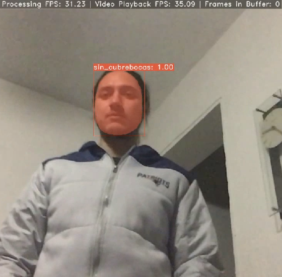

# Clasificador de imágenes especializado en detectar cubrebocas en tiempos de Covid-19

Modelo entrenado con la red Yolact para detectar el tipo de uso de un cubrebocas en personas. Presentado como Proyecto Terminal en la Universidad Autónoma Metropolitana para obtener el título de Ingeniero en Computación.

Publicación y repositorio original de Yolact
 - [YOLACT: Real-time Instance Segmentation](https://arxiv.org/abs/1904.02689)
 - [YOLACT](https://github.com/dbolya/yolact)

## Instrucciones

*Se exhorta a utilizar Google Colab para correr los siguientes cuadernos. En caso de correrlos localmente, revisar los pasos para [instalar](https://github.com/dbolya/yolact#installation) un ambiente virtual para Yolact.*

Los pasos para efectuar la evaluación del modelo se encuentran en:

 - [Evaluación](https://colab.research.google.com/drive/1SZ3XNkn3zzin06Xw_NvA84Ejg4nlTW3Y?usp=sharing)

Si se quiere seguir todo el proceso, complete los siguientes cuadernos en orden:

1. [Acondicionamiento](https://colab.research.google.com/drive/165lh2onF2asnDUs-mcjcigO0LTIpTuSW?usp=sharing)
2. [Entrenamiento](https://colab.research.google.com/drive/1YM4I9RuikdHViDfkZcycnAYuc6ovXFkh?usp=sharing)
3. [Evaluación](https://colab.research.google.com/drive/1SZ3XNkn3zzin06Xw_NvA84Ejg4nlTW3Y?usp=sharing)
4. [Graficación](https://colab.research.google.com/drive/1TtktIkq5nsmxZOQQWvfTE5WcvlU-VK0-?usp=sharing)

### Material

 - Pesos del modelo: [yolact_facemask_416_40000.pth](https://drive.google.com/file/d/1-1k5bKwFC6miuZJSMVwxo16d3fkERBaK/view?usp=sharing)
 - Dataset con el que se entreno: [facemask-dataset](https://github.com/prsantiago/facemask-dataset)
 - Bitacora del entrenamiento: [yolact_facemask_416_40000.log](https://drive.google.com/file/d/1sr-xU0dZ0ZjD8wxicUy6L7aSPwge01Wn/view?usp=sharing)

## Ejemplos

Algunas detecciones realizadas con el clasificador:

